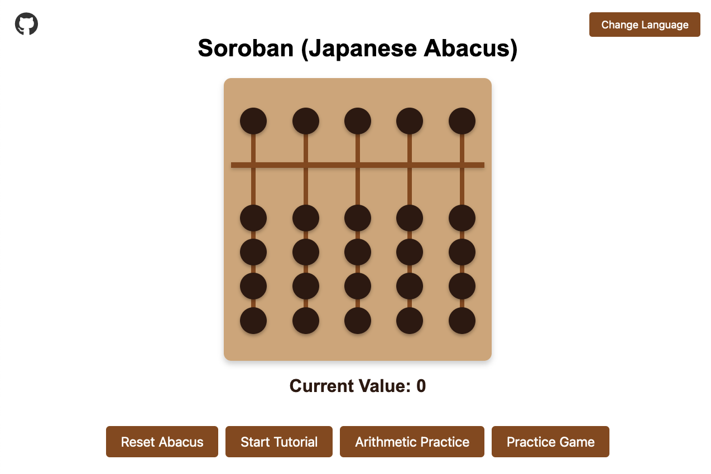
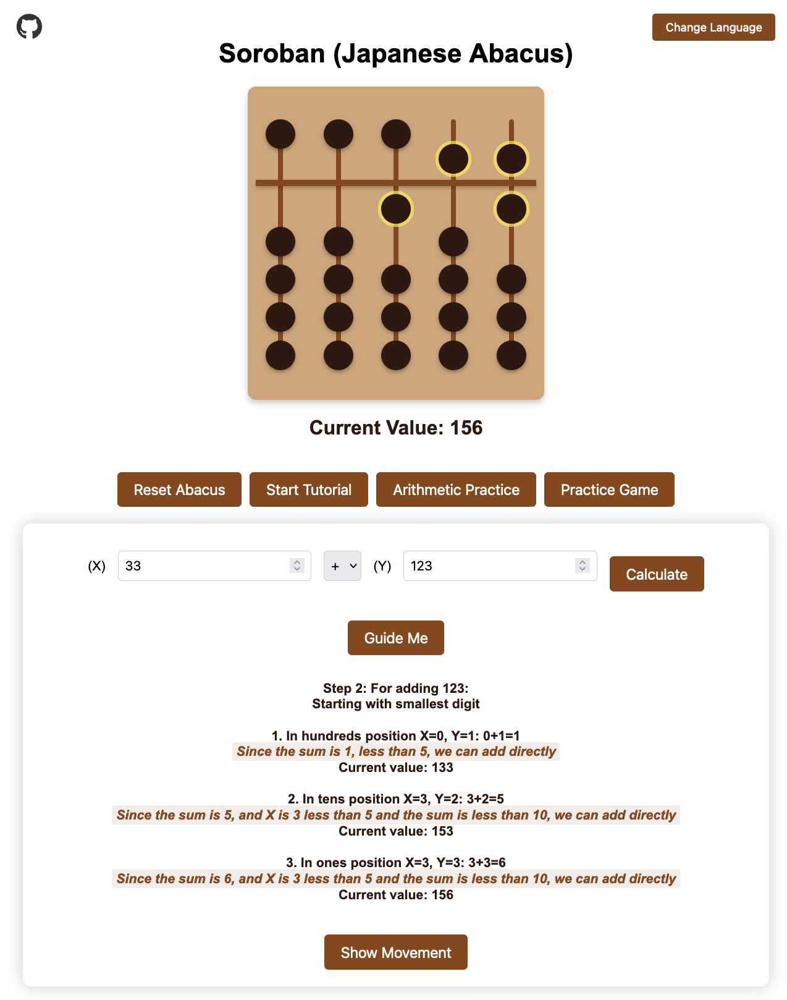
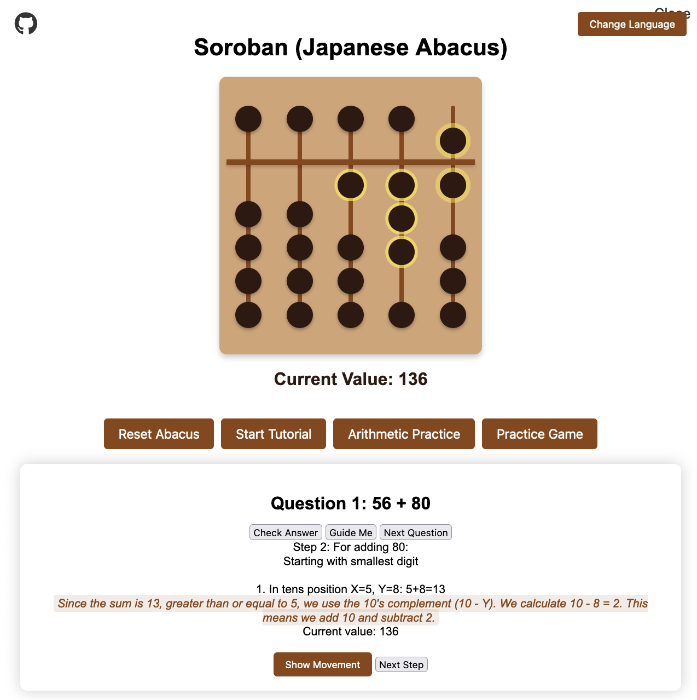

  

  🌐 Language:
  <a href="README.md">  English</a> |
  <a href="README.ms.md">  Bahasa Melayu</a> |
  <a href="README.zh.md">  Mandarin</a> |
  <a href="README.ta.md">  Tamil</a>

# 🧮 Japanese Abacus (Soroban) Learning Application

An interactive web-based Japanese Abacus (Soroban) simulator designed to help users learn and practice arithmetic calculations using traditional Japanese methods.

## ✨ Features

- **Interactive Abacus**: 🖱️ Fully functional digital soroban with realistic bead movements.
- **Tutorial Mode**: 📚 Step-by-step guidance for beginners to learn abacus basics.
- **Arithmetic Practice**: ➕➖➗✖️ Guided practice for addition, subtraction, multiplication, and division.
  - Learn more about [Addition](ADDITION.md) and [Subtraction](SUBTRACTION.md) techniques.
- **Practice Game**: 🎮 Test your skills with configurable difficulty levels:
  - Choose number ranges (single to triple digits)
  - Select operation types
  - Set number of questions
  - Get immediate feedback and final scores
  - Option for guided assistance during practice

## 📱 Progressive Web App Features

### Installation

You can install this app on your device:

- 💻 **Desktop (Chrome/Edge)**: Click the install icon (⊕) in the address bar
- 🤖 **Android**: Tap "Add to Home Screen" in browser menu
- 🍎 **iOS**: Use Share button and select "Add to Home Screen"

### Offline Capability

The Abacus Simulator works fully offline after installation:

- 📶 Access all features without internet connection
- 🧮 Practice calculations anywhere
- 🔄 Automatic sync when back online
- 📦 Cache updates automatically with new versions

### Benefits

- 🚀 Fast loading times
- 💻 Desktop app-like experience
- 📱 Mobile-friendly interface
- 🔄 Automatic updates
- 📶 Works without internet

## 🕹️ How to Use

1.  **Basic Operation**
    -   Click beads to move them up or down
    -   Top bead = 5 units
    -   Bottom beads = 1 unit each

2.  **Learning Modes**
    -   Start with Tutorial to learn basic movements
    -   Use Arithmetic Practice for guided calculations
    -   Test your skills with Practice Game

## ⚙️ Technical Details

Built using pure HTML, CSS, and JavaScript with features including:
- Modular code structure
- Real-time value calculation
- Dynamic bead positioning
- Interactive user interface

## 👨‍💻 Development

This project is structured into multiple components:
- Core abacus functionality (`script.js`)
- Tutorial system (`tutorial.js`)
- Arithmetic practice (`arithmetic.js`)
- Practice game (`game.js`)
- Bead movements (`movements.js`)
- Styling components (`*.css`)

## 🛠️ Built With

This application was 100% built using:

-    - Sourcegraph Cody, an AI coding assistant.
-    - Visual Studio Code, a source code editor.

## 🤖 Android APK (sideload for restricted kids tablets)

Some kids tablets cannot install PWAs. The app ships as a sideloadable APK via Capacitor (same approach as Hand-Math): the APK wraps the staged `www/` build, and the in-app update checker compares `js/appVersion.js` against the latest GitHub release tag, offering the release `*.apk` download in the system browser where Android handles install.

### Version lockstep (bump all four together)

- `config.js` `APP_CONFIG.VERSION` (PWA cache + `version.json` via `npm run sync-version`)
- `package.json` `"version"`
- `js/appVersion.js` `window.ALOHA_VERSION` (update checker truth — WebView cannot read native versionName)
- `android/app/build.gradle` `versionCode` (monotonic integer for update installs) + `versionName`

After a release is published, update `latest.json` `tag` to the new `vX.Y.Z` and push (rate-limit fallback source; release-first ordering so a stale tag only under-reports).

### Build

- `npm install`
- `npm run android:apk` — debug APK (`android/app/build/outputs/apk/debug/app-debug.apk`)
- `npm run android:apk-release` — release APK (needs `android/keystore.properties`: `storeFile`/`storePassword`/`keyAlias`/`keyPassword`, git-ignored)
- Release signing output: `android/app/build/outputs/apk/release/app-release.apk`

### Publish

- `gh release create vX.Y.Z Aloha-vX.Y.Z.apk --latest` (attach the APK)
- Update `latest.json`, commit, push
- In-app Changelog modal (`js/changelog.js`, regenerated by `npm run generate-changelog`) shows the current build history; **Check for updates** forces a release check

## 🌐 Live Demo

Try it here: [https://bizzkoot.github.io/aloha/](https://bizzkoot.github.io/aloha/)

## 📸 Screenshots

Here are some screenshots of the application:

### Main Screen

  

  The main screen of the application, showing the interactive soroban.

### Arithmetic Practice

  

  A view of the arithmetic practice mode, where users can perform guided calculations.

### Practice Game

  

  The practice game mode, where users can test their skills with configurable difficulty levels.

# aloha
