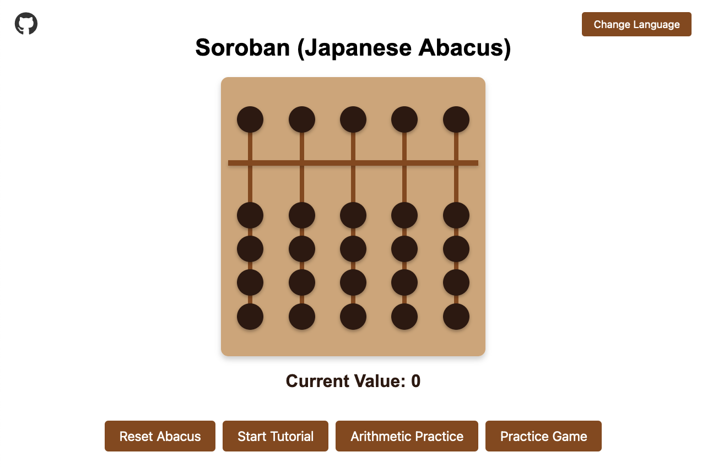
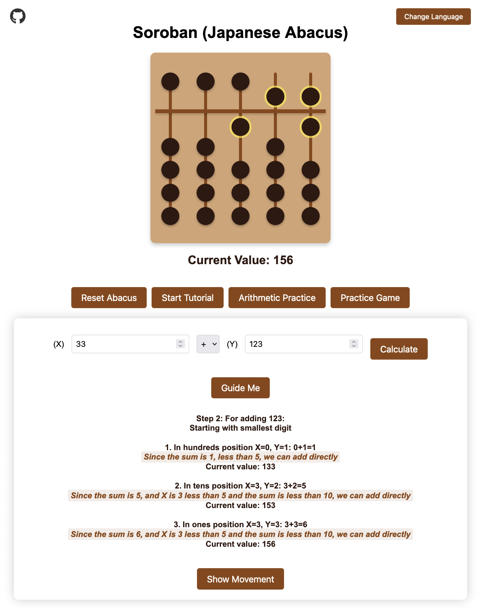
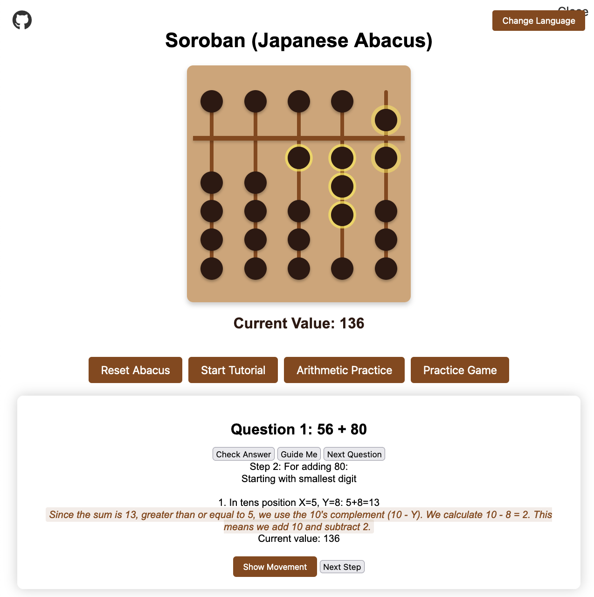

  

  🌐 மொழி:
  <a href="README.md">  ஆங்கிலம்</a> |
  <a href="README.ms.md">  மலாய்</a> |
  <a href="README.zh.md">  சீனம்</a> |
  <a href="README.ta.md">  தமிழ்</a>

# 🧮 ஜப்பானிய மணிக்கூட்டு (சோரோபன்) கற்றல் பயன்பாடு

பாரம்பரிய ஜப்பானிய முறைகளைப் பயன்படுத்தி எண்கணிதக் கணக்கீடுகளைக் கற்றுக்கொள்ளவும் பயிற்சி செய்யவும் பயனர்களுக்கு உதவும் வகையில் வடிவமைக்கப்பட்ட ஒரு ஊடாடும் வலை அடிப்படையிலான ஜப்பானிய மணிக்கூட்டு (சோரோபன்) சிமுலேட்டர்.

## ✨ அம்சங்கள்

- **ஊடாடும் மணிக்கூட்டு**: 🖱️ யதார்த்தமான மணி இயக்கங்களுடன் முழுமையாக செயல்படும் டிஜிட்டல் சோரோபன்.
- **பயிற்சி முறை**: 📚 மணிக்கூட்டு அடிப்படைகளை கற்க ஆரம்பிப்பவர்களுக்கான படிப்படியான வழிகாட்டுதல்.
- **எண்கணித பயிற்சி**: ➕➖➗✖️ கூட்டல், கழித்தல், பெருக்கல் மற்றும் வகுத்தல் ஆகியவற்றிற்கான வழிகாட்டப்பட்ட பயிற்சி.
  - [கூட்டல்](ADDITION.ta.md) மற்றும் [கழித்தல்](SUBTRACTION.ta.md) நுட்பங்களைப் பற்றி மேலும் அறிக.
- **பயிற்சி விளையாட்டு**: 🎮 கட்டமைக்கக்கூடிய சிரம நிலைகளுடன் உங்கள் திறன்களை சோதிக்கவும்:
  - எண் வரம்புகளைத் தேர்வு செய்யவும் (ஒற்றை முதல் மூன்று இலக்கங்கள் வரை)
  - செயல்பாட்டு வகைகளைத் தேர்ந்தெடுக்கவும்
  - கேள்விகளின் எண்ணிக்கையை அமைக்கவும்
  - உடனடி கருத்து மற்றும் இறுதி மதிப்பெண்களைப் பெறுங்கள்
  - பயிற்சி செய்யும் போது வழிகாட்டப்பட்ட உதவிக்கான விருப்பம்

## 📱 முற்போக்கான வலை பயன்பாட்டு அம்சங்கள்

### நிறுவுதல்

இந்த பயன்பாட்டை உங்கள் சாதனத்தில் நிறுவலாம்:

- 💻 **டெஸ்க்டாப் (Chrome/Edge)**: முகவரிப் பட்டியில் உள்ள நிறுவு ஐகானை (⊕) கிளிக் செய்யவும்
- 🤖 **Android**: உலாவி மெனுவில் "முகப்புத் திரையில் சேர்" என்பதைத் தட்டவும்
- 🍎 **iOS**: பகிர் பொத்தானைப் பயன்படுத்தி "முகப்புத் திரையில் சேர்" என்பதைத் தேர்ந்தெடுக்கவும்

### ஆஃப்லைன் திறன்

மணிக்கூட்டு சிமுலேட்டர் நிறுவிய பின் முழுமையாக ஆஃப்லைனில் வேலை செய்கிறது:

- 📶 இணைய இணைப்பு இல்லாமல் அனைத்து அம்சங்களையும் அணுகவும்
- 🧮 எங்கு வேண்டுமானாலும் கணக்கீடுகளைப் பயிற்சி செய்யுங்கள்
- 🔄 மீண்டும் ஆன்லைனில் வரும்போது தானியங்கி ஒத்திசைவு
- 📦 புதிய பதிப்புகளுடன் தானாகவே தற்காலிக சேமிப்பை புதுப்பிக்கவும்

### நன்மைகள்

- 🚀 வேகமான ஏற்றுதல் நேரங்கள்
- 💻 டெஸ்க்டாப் பயன்பாடு போன்ற அனுபவம்
- 📱 மொபைல் நட்பு இடைமுகம்
- 🔄 தானியங்கி புதுப்பிப்புகள்
- 📶 இணையம் இல்லாமல் வேலை செய்கிறது

## 🕹️ எப்படி உபயோகிப்பது

1.  **அடிப்படை செயல்பாடு**
    -   மணிகளை மேலும் கீழும் நகர்த்த கிளிக் செய்யவும்
    -   மேல் மணி = 5 அலகுகள்
    -   கீழ் மணிகள் = தலா 1 அலகு

2.  **கற்றல் முறைகள்**
    -   அடிப்படை இயக்கங்களைக் கற்க பயிற்சியுடன் தொடங்கவும்
    -   வழிகாட்டப்பட்ட கணக்கீடுகளுக்கு எண்கணித பயிற்சியைப் பயன்படுத்தவும்
    -   பயிற்சி விளையாட்டின் மூலம் உங்கள் திறன்களை சோதிக்கவும்

## ⚙️ தொழில்நுட்ப விவரங்கள்

தூய HTML, CSS மற்றும் JavaScript ஐப் பயன்படுத்தி கட்டமைக்கப்பட்டது, இதில் அம்சங்கள் உள்ளன:
- மட்டுப்படுத்தப்பட்ட குறியீடு அமைப்பு
- நிகழ்நேர மதிப்பு கணக்கீடு
- டைனமிக் மணி நிலைப்படுத்தல்
- ஊடாடும் பயனர் இடைமுகம்

## 👨‍💻 மேம்பாடு

இந்த திட்டம் பல கூறுகளாக கட்டமைக்கப்பட்டுள்ளது:
- முக்கிய மணிக்கூட்டு செயல்பாடு (`script.js`)
- பயிற்சி அமைப்பு (`tutorial.js`)
- எண்கணித பயிற்சி (`arithmetic.js`)
- பயிற்சி விளையாட்டு (`game.js`)
- மணி இயக்கங்கள் (`movements.js`)
- ஸ்டைலிங் கூறுகள் (`*.css`)

## 🛠️ உடன் கட்டப்பட்டது

இந்த பயன்பாடு 100% பின்வருவனவற்றைப் பயன்படுத்தி உருவாக்கப்பட்டது:

-    - Sourcegraph Cody, ஒரு AI கோடிங் உதவியாளர்.
-    - Visual Studio Code, ஒரு மூலக் குறியீடு ஆசிரியர்.

## 🌐 நேரடி டெமோ

இங்கே முயற்சிக்கவும்: [https://bizzkoot.github.io/aloha/](https://bizzkoot.github.io/aloha/)

## 📸 ஸ்கிரீன்ஷாட்கள்

பயன்பாட்டின் சில ஸ்கிரீன்ஷாட்கள் இங்கே:

### பிரதான திரை

  

  ஊடாடும் சோரோபனைக் காட்டும் பயன்பாட்டின் பிரதான திரை.

### எண்கணித பயிற்சி

  

  எண்கணித பயிற்சி முறையின் காட்சி, அங்கு பயனர்கள் வழிகாட்டப்பட்ட கணக்கீடுகளைச் செய்யலாம்.

### பயிற்சி விளையாட்டு

  

  பயிற்சி விளையாட்டு முறை, இதில் பயனர்கள் கட்டமைக்கக்கூடிய சிரம நிலைகளுடன் தங்கள் திறன்களை சோதிக்க முடியும்.

# aloha
