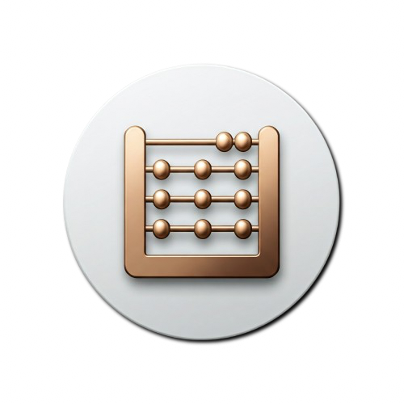
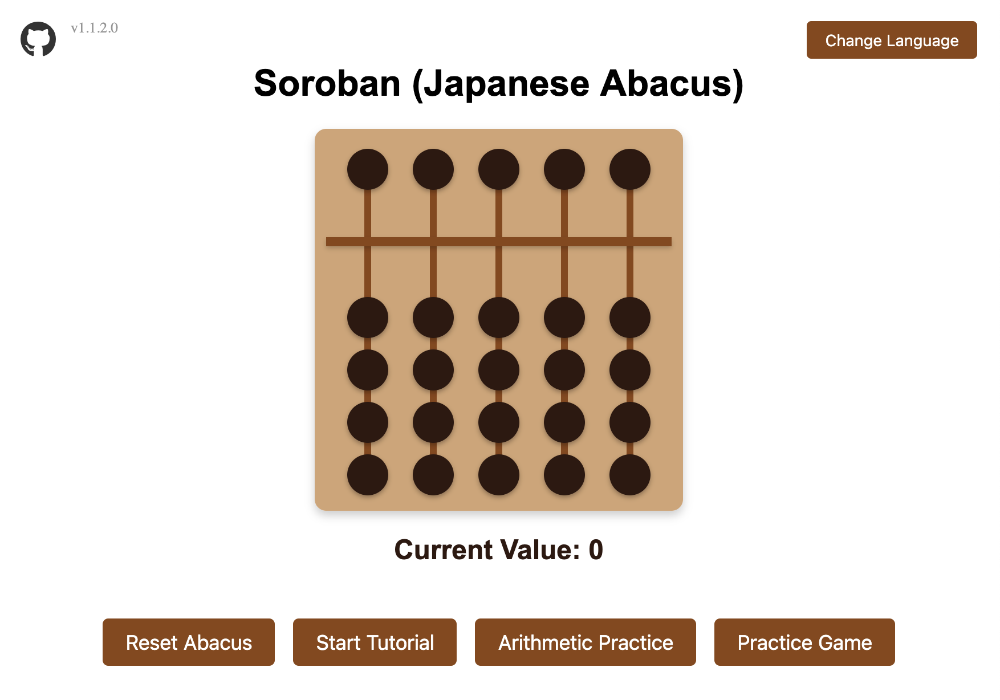
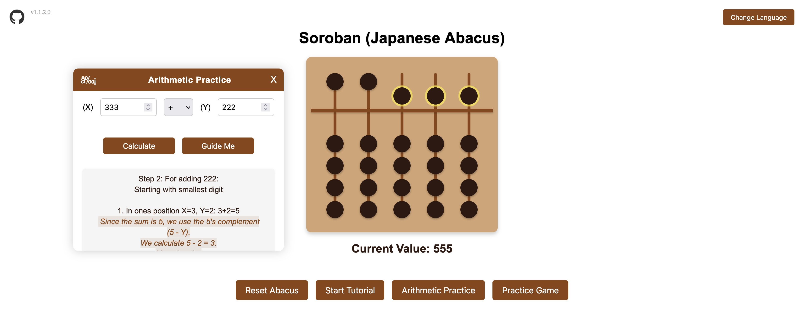
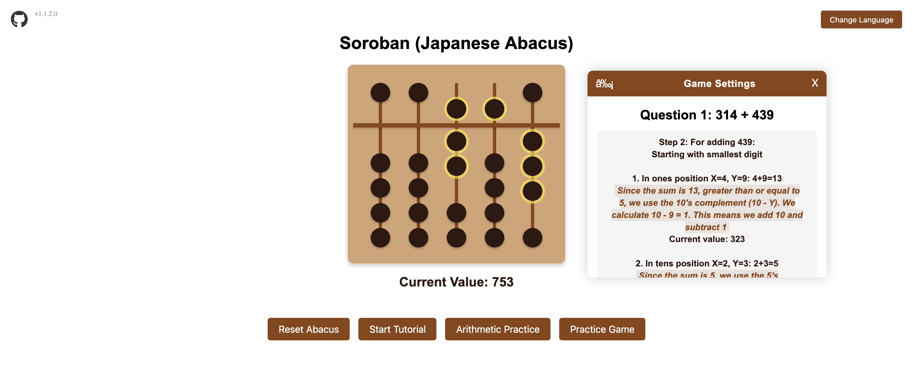

  

  🌐 语言:
  <a href="README.md">  英语</a> |
  <a href="README.ms.md">  马来语</a> |
  <a href="README.zh.md">  中文</a> |
  <a href="README.ta.md">  泰米尔语</a>

# 🧮 日式算盘 (Soroban) 学习应用

一个交互式的基于网络的日式算盘 (Soroban) 模拟器，旨在帮助用户学习和练习使用传统日本方法进行算术计算。

## ✨ 功能

- **交互式算盘**: 🖱️ 功能齐全的数字算盘，具有逼真的珠子移动。
- **教程模式**: 📚 为初学者学习算盘基础知识提供的逐步指导。
- **算术练习**: ➕➖➗✖️ 加法、减法、乘法和除法的引导练习。
  - 了解更多关于[加法](ADDITION.zh.md)和[减法](SUBTRACTION.zh.md)的技巧。
- **练习游戏**: 🎮 通过可配置的难度级别测试您的技能：
  - 选择数字范围（一位数到三位数）
  - 选择运算类型
  - 设置问题数量
  - 获取即时反馈和最终得分
  - 在练习期间选择引导帮助

## 🕹️ 如何使用

1.  **基本操作**
    -   单击珠子向上或向下移动它们
    -   顶部珠子 = 5 个单位
    -   底部珠子 = 每个 1 个单位

2.  **学习模式**
    -   从教程开始学习基本动作
    -   使用算术练习进行引导计算
    -   通过练习游戏测试您的技能

## ⚙️ 技术细节

使用纯 HTML、CSS 和 JavaScript 构建，具有以下功能：
- 模块化代码结构
- 实时值计算
- 动态珠子定位
- 交互式用户界面

## 👨‍💻 开发

该项目分为多个组件：
- 核心算盘功能 (`script.js`)
- 教程系统 (`tutorial.js`)
- 算术练习 (`arithmetic.js`)
- 练习游戏 (`game.js`)
- 珠子移动 (`movements.js`)
- 样式组件 (`*.css`)

## 🛠️ 构建工具

此应用程序 100% 使用以下工具构建：

-    - Sourcegraph Cody，一个 AI 编码助手。
-    - Visual Studio Code，一个源代码编辑器。

## 🌐 在线演示

在此处尝试：[https://bizzkoot.github.io/aloha/](https://bizzkoot.github.io/aloha/)

## 📸 屏幕截图

以下是一些应用程序的屏幕截图：

### 主屏幕

  

  应用程序的主屏幕，显示交互式算盘。

### 算术练习

  

  算术练习模式的视图，用户可以在其中执行引导计算。

### 练习游戏

  

  练习游戏模式，用户可以在其中通过可配置的难度级别测试他们的技能。

# aloha
